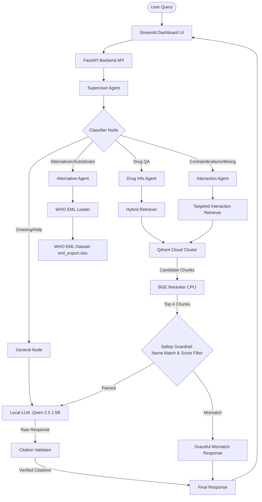

# PharmaAssist DSLM 💊
### Enterprise-Grade Healthcare Domain-Specific Language Model (DSLM)

PharmaAssist DSLM is an intelligent decision support system designed for pharmacists, hospitals, medical stores, and healthcare professionals. Operating on commodity hardware (specifically optimized for a **4GB RTX 3050** VRAM footprint), the platform provides accurate, evidence-backed, and programmatically validated citation responses for drug-related queries.

---

## 1. System Architecture

The following diagram illustrates the end-to-end data flow and multi-agent routing architecture:



---

## 2. Core Technical Stack

| Component | Technology | Rationale | Hardware Mapping |
| :--- | :--- | :--- | :--- |
| **User Interface** | Streamlit | Responsive, interactive, custom-styled dashboard. Supports session state chat histories and multi-tab workflows. | Client Device |
| **Backend API** | FastAPI | High-performance, async-ready Python REST API. Hosts endpoint routing and LangGraph supervisor initialization. | Local Server |
| **Agent Orchestrator**| LangGraph | Directed state graphs with conditional routing nodes. Coordinates worker agents (Drug, Interaction, Alternative) and handles validation cycles. | CPU |
| **Local LLM** | Qwen 2.5 1.5B Instruct | State-of-the-art 1.5B model. Exceptional reasoning-per-parameter, natively supports complex system prompts and citation instructions. | **GPU (RTX 3050 VRAM)** |
| **Embeddings** | BAAI/bge-small-en-v1.5| High MTEB ranking, lightweight (384 dimensions), provides dense semantic query matching. | **CPU** |
| **Reranker** | BAAI/bge-reranker-base| Cross-encoder model that scores query-document pairs together. Dramatically reduces context window noise. | **CPU** |
| **Vector Database** | Qdrant Cloud | HNSW indexed vector store. Leveraged for sub-millisecond semantic search and scrolls with structured payload indexes. | Qdrant Cloud Cluster |
| **Local Datasets** | OpenFDA JSON + WHO EML Excel | Streamed parsing of 13 massive ZIP files filtered against the WHO Essential Medicines List. | Local Storage / Memory |

---

## 3. Detailed Query Workflows

### Type A: Clinical Drug Info (e.g., "Amoxicillin warnings")
1. **Classifier**: Determines the query is `drug_info`.
2. **Retrieval**: Executes a **Hybrid Search** (Dense Semantic Vector + Sparse Keyword Scroll) in Qdrant.
3. **Reranking**: Reranks the top 15 candidate chunks down to 4 using the cross-encoder.
4. **Safety Filter**: Compares the query words against the retrieved chunks' generic and brand names. If no alignment is found, the chunks are discarded to prevent hallucinations.
5. **Generation**: The LLM synthesizes an answer using the remaining chunks and appends inline index tags (e.g., `[Doc 1]`).
6. **Validation**: The validator verifies that every citation in the response matches a real, retrieved chunk.

### Type B: Drug-to-Drug Interactions (e.g., "Metformin and Ibuprofen")
1. **Classifier**: Detects interaction terms; routes to `interaction`.
2. **Extraction**: Isolates the query's non-stop words (drug names like `['metformin', 'ibuprofen']`).
3. **Targeted Retrieval**: Queries the database specifically for each drug's warning, contraindication, and interaction segments.
4. **Reranking**: Scores the merged candidates against the user's interaction query.
5. **Name Filtering**: Verifies that the chunks match *at least one* of the extracted drugs.
6. **Generation**: LLM produces the interaction analysis or returns a graceful "no interaction found in database" notice.

### Type C: WHO Alternative Lookup (e.g., "Alternative for Amoxicillin")
1. **Classifier**: Detects alternative keywords; routes to `alternative`.
2. **Lookup**: The `AlternativeMedicineAgent` checks the `who_loader` database (`eml_export.xlsx`) for the drug's therapeutic category and lists official EML alternatives.
3. **Context Enrichment**: Performs a RAG search on the first alternative drug to display its clinical profile with citations.

### Type D: General Conversation (e.g., "hii", "help")
1. **Classifier**: Detects greeting/general conversational queries; routes to `general`.
2. **Direct Response**: Routes to an LLM node with a specific prompt explaining capabilities. No vector store retrieval is done, and verification warning notes are bypassed.

---

## 4. Technical Counter-Questions & FAQ

### Q: Why a 1.5B LLM instead of a larger model (e.g., 7B or 8B)?
* **Hardware Constraint (VRAM)**: A 7B parameter model (FP16 or quantized) requires between 6GB and 10GB of VRAM. Operating on an RTX 3050 (4GB VRAM) would lead to immediate Out-Of-Memory (OOM) errors or push the model into system RAM, resulting in extremely slow token generation (less than 1 token/sec). 
* **Optimized Split**: The Qwen 2.5 1.5B quantized model fits entirely in 1.8GB of VRAM, leaving remaining memory for system overhead. By offloading the Embeddings and Reranker models to the CPU, the GPU is dedicated exclusively to LLM generation, ensuring fast responses (30+ tokens/sec).

### Q: How does the system prevent Hallucinations?
Hallucinations are prevented through a three-stage guardrail system:
1. **Deterministic Name Alignment Check**: If the user asks about *Drug A*, but semantic search retrieves a high-scoring chunk for *Drug B* (e.g., because they have similar warning formats), the alignment checker compares the query words with the retrieved chunks' metadata. If they do not match, the chunk is filtered out.
2. **Score Thresholding**: Candidate chunks with low cross-encoder rerank scores (below `-0.5`) are discarded.
3. **Prompt Constraints**: The LLM's system prompt strictly dictates: *"Base your answer ONLY on the provided context. If the context does not contain the answer, explicitly state that the information was not found."*

### Q: How does the Citation Verification engine work?
We implement a **programmatic validator** that parses the LLM's final response:
1. It uses regular expressions to find all citation tags (`\[Doc \d+\]`).
2. For each tag, it matches the index back to the exact chunk sent to the LLM.
3. It performs a substring containment check, verifying that the clinical facts stated near the tag match the text payload in the source document.
4. If a citation is invalid or cannot be verified, it strips the false tag and appends a clear warning to the user: *"Note: This information could not be programmatically verified against the local label databases."*

### Q: How does the system handle different drug names (e.g., Paracetamol vs. Acetaminophen)?
* The US FDA dataset indexes the drug under **Acetaminophen** (USAN), whereas the WHO EML and international users search for **Paracetamol** (INN). 
* We implemented a central **Synonym Translation Layer** (`paracetamol` $\leftrightarrow$ `acetaminophen` and `aspirin` $\leftrightarrow$ `acetylsalicylic acid`). This expands keyword search terms and name-alignment checks so that queries using international names resolve seamlessly to their US database equivalents.

### Q: Why is Hybrid Search (Vector + Keyword) necessary?
* **Semantic Vector Search** is excellent for conceptual queries (e.g., "what to take for high blood pressure"), but can miss specific brand names or exact codes due to vector space smoothing.
* **Keyword Scroll Search** ensures that searching for exact terms (e.g., "Glucophage" or "C03DA01") guarantees the retrieval of the exact corresponding record, bypassing semantic approximations.

### Q: How are network timeouts and cloud disconnects handled?
* Connecting to remote cloud databases from a local client can suffer from transient network dropouts.
* In [qdrant_manager.py](file:///C:/Users/HP/projects/DSLM_Medical/vectorstore/qdrant_manager.py), all scroll, query, and upsert operations are wrapped in an **exponential backoff retry loop** (up to 3 attempts), ensuring the system remains stable during momentary connection blips.

---

## 5. Quick Start Guide

### Prerequisites
* Conda or Miniconda installed.
* Ollama installed and running (`ollama run qwen2.5:1.5b-instruct-q4_K_M`).

### Setup & Launch
1. **Activate the Environment**:
   ```bash
   conda activate thermo_agent
   ```
2. **Configure Environment Variables**:
   Create a `.env` file at the root:
   ```env
   QDRANT_HOST=https://your-qdrant-cloud-url.io
   QDRANT_API_KEY=your-api-key
   OLLAMA_HOST=http://localhost:11434
   OLLAMA_MODEL=qwen2.5:1.5b-instruct-q4_K_M
   MAX_RECORDS_PER_FILE=50
   ONLY_ESSENTIAL_DRUGS=True
   ```
3. **Run Ingestion** (optional if database is already populated):
   ```bash
   python -m ingestion.pipeline
   ```
4. **Start the API Backend**:
   ```bash
   python -m api.main
   ```
5. **Start the Streamlit UI Dashboard**:
   ```bash
   streamlit run frontend/streamlit_app.py
   ```
